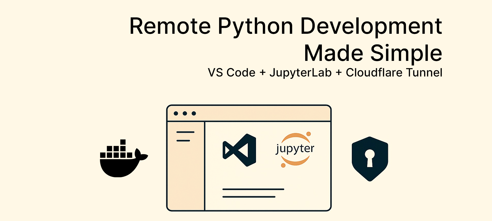

# Jupyter-Code-Container: Dockerized Dev Environment [](https://hub.docker.com/r/chaichy/jupyter-code-container)



> ✅ Now available in two flavors: CPU and GPU (CUDA-enabled)

A single Docker image for remote Python development:  
VS Code (`code-server`) + JupyterLab + secure Cloudflare Tunnel, all set up and ready to go.

---

## 🚀 Quick Start

**Get up and running in just a few steps:**

```bash
# CPU flavor
docker pull chaichy/jupyter-code-container:cpu

# GPU flavor (with CUDA, PyTorch)
docker pull chaichy/jupyter-code-container:gpu
```

### Run the CPU image

```bash
docker run -d \
  --name dev-cpu \
  -v /absolute/path/to/workspace:/workspace \
  -e CF_TUNNEL_TOKEN="<your-cloudflared-token>" \
  -e JUPYTER_TOKEN="<your-jupyter-token>" \
  -e PASSWORD="<your-vscode-password>" \
  -e REQUIREMENTS_FILE="/workspace/requirements.txt" \
  chaichy/jupyter-code-container:cpu
```

### Run the GPU image

```bash
docker run -d --gpus all \
  --name dev-gpu \
  -v /absolute/path/to/workspace:/workspace \
  -e CF_TUNNEL_TOKEN="<your-cloudflared-token>" \
  -e JUPYTER_TOKEN="<your-jupyter-token>" \
  -e PASSWORD="<your-vscode-password>" \
  -e REQUIREMENTS_FILE="/workspace/requirements.txt" \
  chaichy/jupyter-code-container:gpu
```

---

## 🌐 One-Click Deployment: RunPod

Want a full dev environment in the cloud in minutes?  
**[Deploy this stack on RunPod with a single click using the CPU Template](https://runpod.io/console/deploy?template=kj8bldufic&ref=7v5mhnoa)** or use the [GPU Template instead](https://runpod.io/console/deploy?template=a2azpbomix&ref=7v5mhnoa).

### RunPod Best Practices

- Two flavors available — make sure you select the right instance type:
  - `:cpu` → for all-purpose dev environments
  - `:gpu` → for machine learning and CUDA workloads (requires GPU instance)

- **Set your environment variables as secrets!**
    - `CF_TUNNEL_TOKEN`
    - `JUPYTER_TOKEN`
    - `PASSWORD`

- **Use Cloudflare Zero Trust**  
  Consider enabling [Cloudflare Zero Trust](https://developers.cloudflare.com/cloudflare-one/zero-trust/) for additional access control and logging. This lets you restrict access to your services based on identity, device posture, or other rules.

- **Mount your data**  
  You can attach a persistent volume to `/workspace` so your code and notebooks persist between sessions.

---

## ✨ Features

- **Unified environment**: One container, both code-server and JupyterLab.
- **Cloudflare Tunnel**: Secure access, no open ports needed ([Cloudflare Tunnels](https://developers.cloudflare.com/cloudflare-one/connections/connect-apps/)).
- **Auto-installed VS Code Extensions**: Python, Jupyter.
- **Mount your code**: Mount a local folder to `/workspace` for editing and notebooks.
- **Pre-configured VS Code ↔ Jupyter integration**.
- **Zsh shell** with Oh My Zsh and automatic Conda activation.

---

## 📦 Repository Structure

```text
├── docker/
│   ├── Dockerfile.cpu
│   └── Dockerfile.gpu
├── scripts/
│   └── entrypoint.sh
├── config/
│   ├── code-server-config.yaml
│   ├── jupyter_notebook_config.py
│   └── environment.yml
└── README.md
```

---

## ⚙️ Prerequisites

- [Docker](https://docs.docker.com/get-docker/) installed on your host
- [Cloudflare Tunnel](https://developers.cloudflare.com/cloudflare-one/connections/connect-apps/install-and-setup/tunnel-guide/) setup, ideally combined with [Cloudflare Zero Trust](https://developers.cloudflare.com/cloudflare-one/zero-trust/) for access control
- A domain & DNS in Cloudflare with [ingress rules](https://developers.cloudflare.com/cloudflare-one/connections/connect-apps/routing-to-tunnel/) for your tunnel

---

## 🛠 Build the Image (optional)

```bash
git clone https://github.com/chaichy/jupyter-code-container.git
cd jupyter-code-container

# CPU build
docker build --platform linux/amd64 \
  -f docker/Dockerfile.cpu \
  -t chaichy/jupyter-code-container:cpu .

# GPU build
docker build --platform linux/amd64 \
  -f docker/Dockerfile.gpu \
  -t chaichy/jupyter-code-container:gpu .
```

---

## 🖥 Run the Container

```bash
docker run -d \
  --name dev-env \
  -v /absolute/path/to/workspace:/workspace \
  -e CF_TUNNEL_TOKEN="<your-cloudflared-token>" \
  -e JUPYTER_TOKEN="<your-jupyter-token>" \
  -e PASSWORD="<your-vscode-password>" \
  -e REQUIREMENTS_FILE="/workspace/requirements.txt" \
  chaichy/jupyter-code-container:latest
```

- `-v /.../workspace:/workspace`: mounts your local workspace
- `CF_TUNNEL_TOKEN`: [Get it here](https://developers.cloudflare.com/cloudflare-one/connections/connect-apps/)
- `JUPYTER_TOKEN`: Password token for JupyterLab
- `PASSWORD`: Password for VS Code
- `REQUIREMENTS_FILE`: Optional path to additional requirements

Access your services:

- **VS Code**: `https://code.YOUR_DOMAIN.com`
- **JupyterLab**: `https://jupyter.YOUR_DOMAIN.com`

---

## ⚡️ Environment Variables

| Variable          | Description                                                           |
| ----------------- | --------------------------------------------------------------------- |
| `CF_TUNNEL_TOKEN` | Cloudflare Tunnel token ([setup guide](https://developers.cloudflare.com/cloudflare-one/connections/connect-apps/)) |
| `JUPYTER_TOKEN`   | Token to secure JupyterLab                                            |
| `PASSWORD`        | Password to secure code-server                                        |
| `TARGETARCH`      | (Optional) Docker build arg for architecture (`amd64`, `arm64`)       |
| `REQUIREMENTS_FILE` | (Optional) Path to a `requirements.txt` installed on startup |

---

## 🧩 VS Code Extensions Installed

- [MS Python](https://marketplace.visualstudio.com/items?itemName=ms-python.python)
- [MS Jupyter](https://marketplace.visualstudio.com/items?itemName=ms-toolsai.jupyter)


## 🧠 Tags & Flavors

| Tag       | Description                              |
|-----------|------------------------------------------|
| `:cpu`    | VS Code + JupyterLab, optimized for CPU  |
| `:gpu`    | Same setup + CUDA/PyTorch                |
| `:latest` | Alias for `:cpu`                         |

## 📄 License

MIT License. See [LICENSE](LICENSE) for details.
